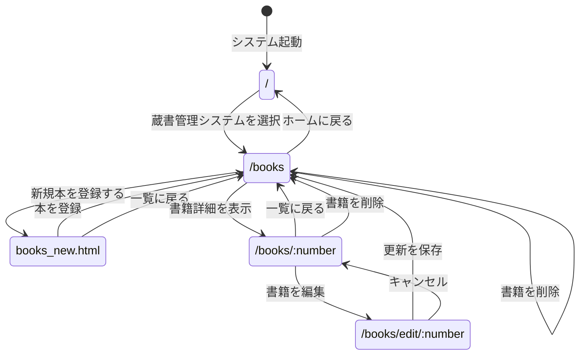
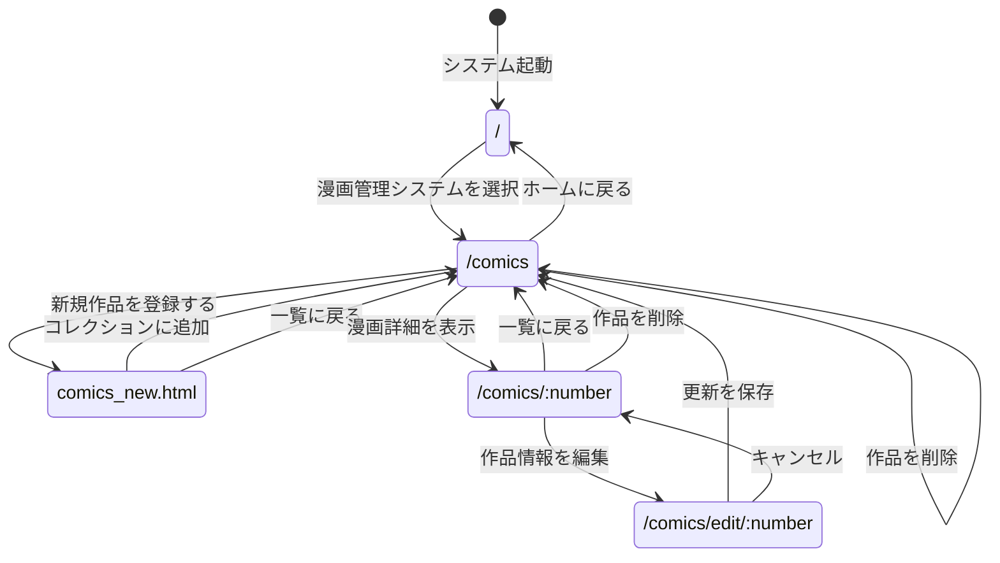
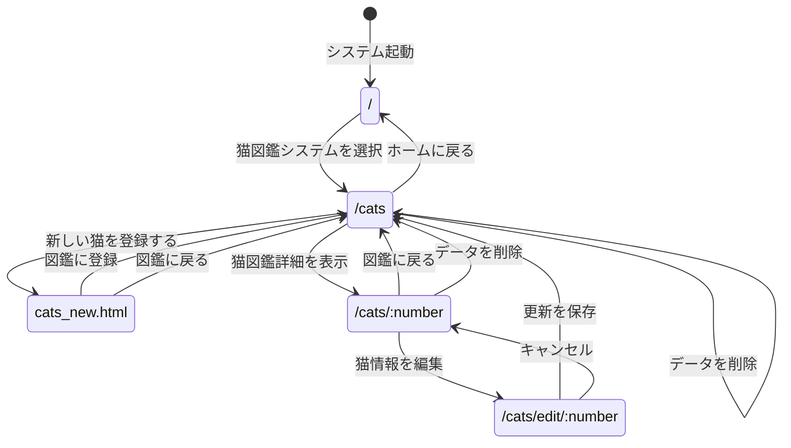

# 開発者向け仕様書(仮)

## 蔵書システム仕様書

本と貸し出しの状況を管理．
本の台本をクリックしてページ遷移

#### ページ遷移図
蔵書管理

```mermaid
stateDiagram-v2
    state "/" as home
    state "/books" as list
    state "books_new.html" as new
    state "/books/:number" as detail
    state "/books/edit/:number" as edit

    [*] --> home : システム起動
    home --> list : 蔵書管理システムを選択
    list --> home : ホームに戻る

    list --> new : 新規本を登録する
    new --> list : 本を登録
    new --> list : 一覧に戻る

    list --> detail : 書籍詳細を表示
    detail --> list : 一覧に戻る

    detail --> edit : 書籍を編集
    edit --> list : 更新を保存
    edit --> detail : キャンセル

    detail --> list : 書籍を削除
    list --> list : 書籍を削除
```

漫画管理

```mermaid
stateDiagram-v2
    state "/" as home
    state "/comics" as list
    state "comics_new.html" as new
    state "/comics/:number" as detail
    state "/comics/edit/:number" as edit

    [*] --> home : システム起動
    home --> list : 漫画管理システムを選択
    list --> home : ホームに戻る

    list --> new : 新規作品を登録する
    new --> list : コレクションに追加
    new --> list : 一覧に戻る

    list --> detail : 漫画詳細を表示
    detail --> list : 一覧に戻る

    detail --> edit : 作品情報を編集
    edit --> list : 更新を保存
    edit --> detail : キャンセル

    detail --> list : 作品を削除
    list --> list : 作品を削除
```

猫図鑑

```mermaid
stateDiagram-v2
    state "/" as home
    state "/cats" as list
    state "cats_new.html" as new
    state "/cats/:number" as detail
    state "/cats/edit/:number" as edit

    [*] --> home : システム起動
    home --> list : 猫図鑑システムを選択
    list --> home : ホームに戻る

    list --> new : 新しい猫を登録する
    new --> list : 図鑑に登録
    new --> list : 図鑑に戻る

    list --> detail : 猫図鑑詳細を表示
    detail --> list : 図鑑に戻る

    detail --> edit : 猫情報を編集
    edit --> list : 更新を保存
    edit --> detail : キャンセル

    detail --> list : データを削除
    list --> list : データを削除
```